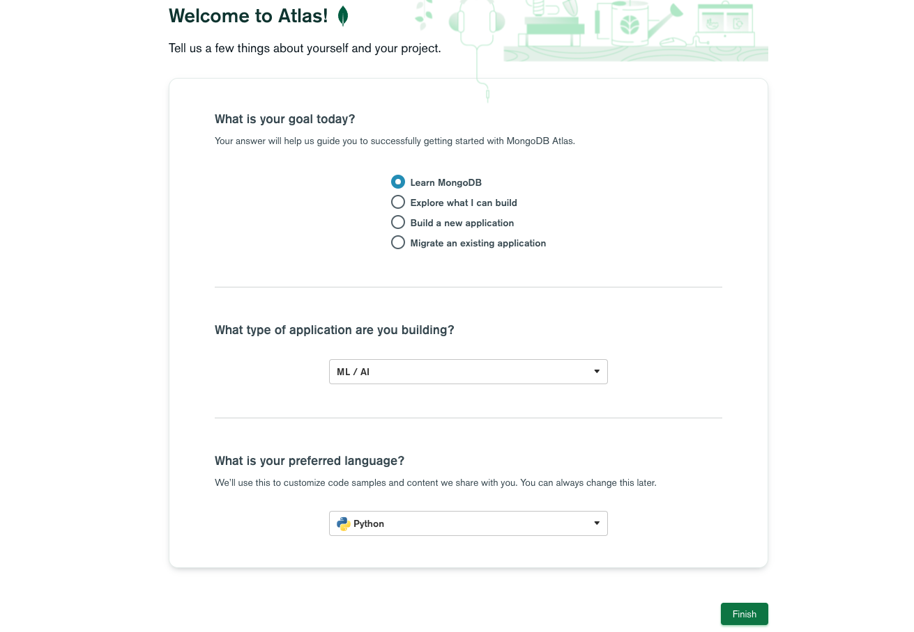
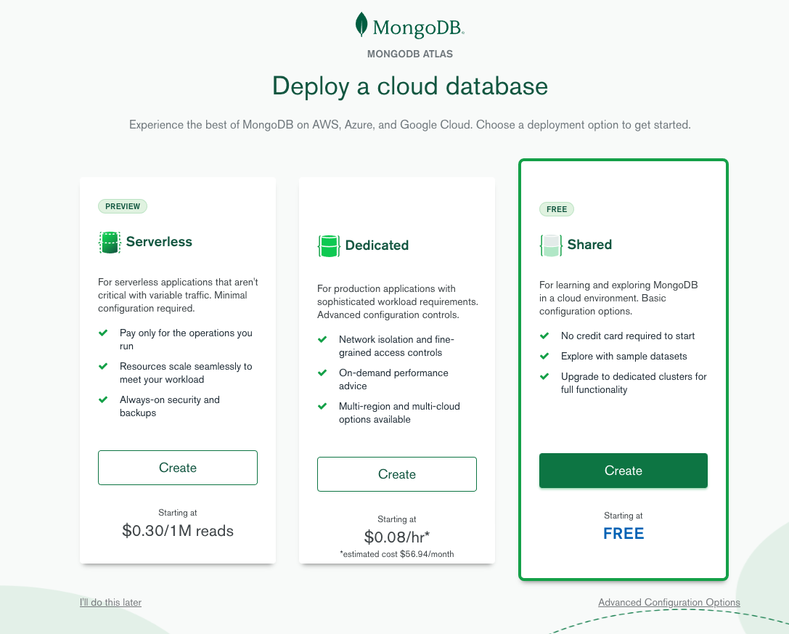
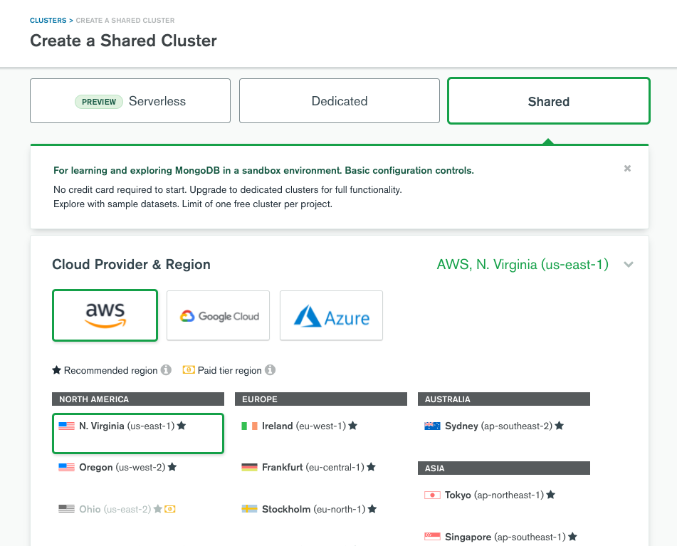
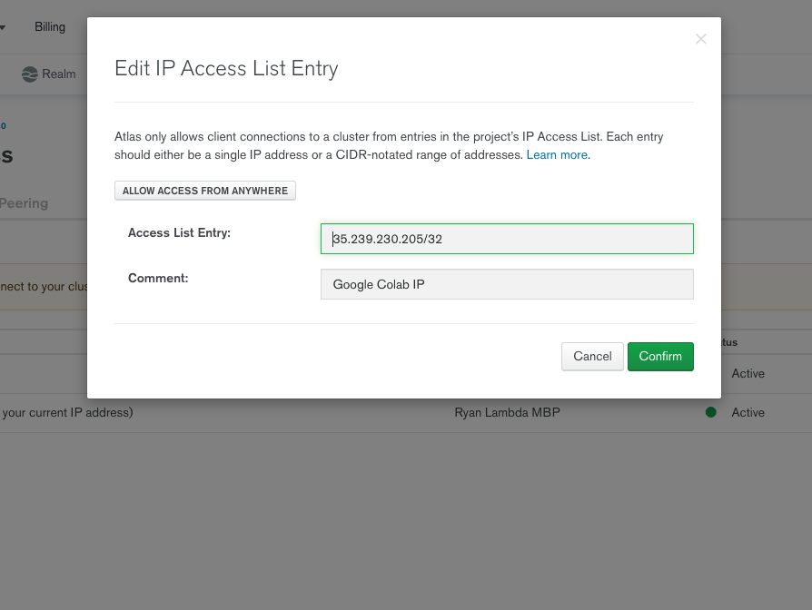
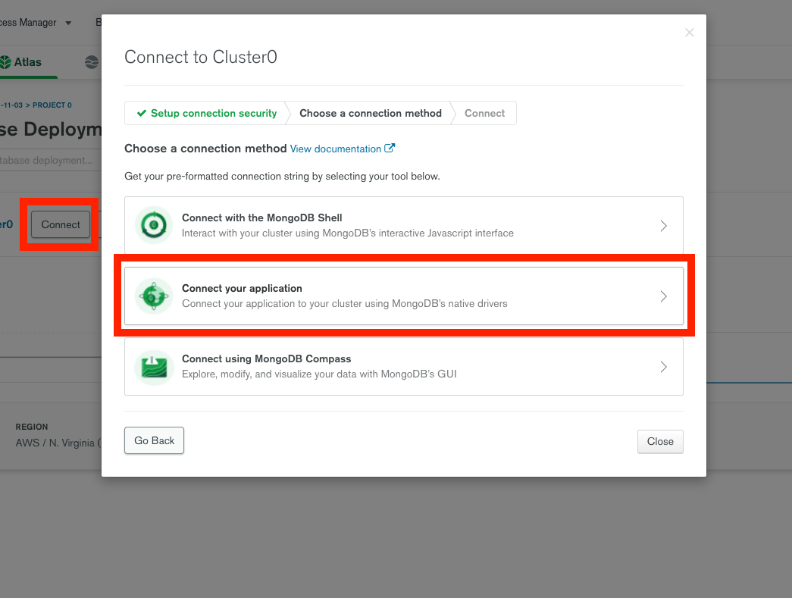
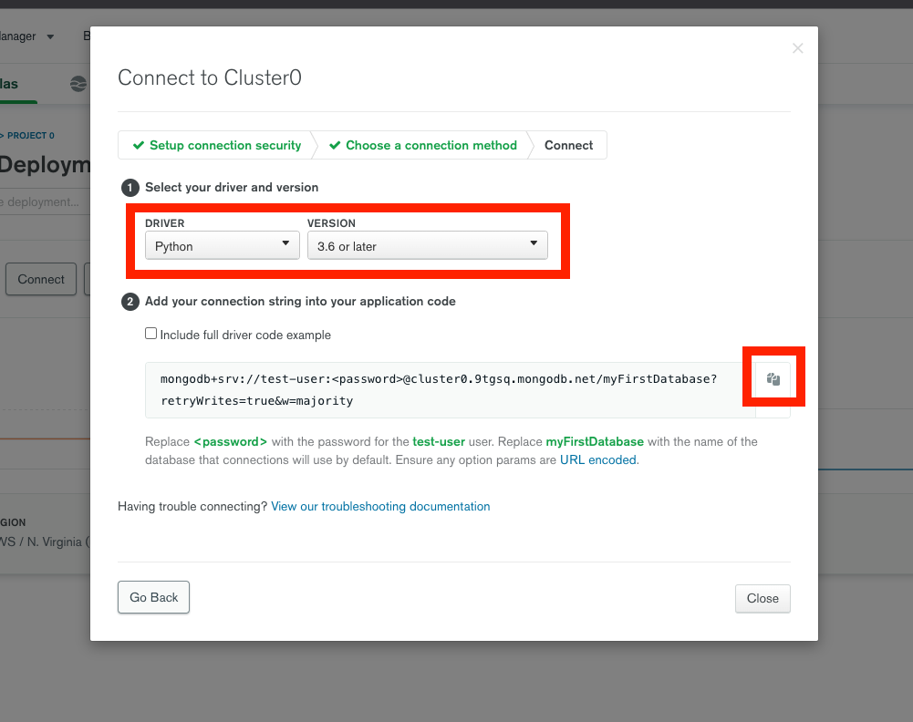

# Guided Project Walkthrough

Another database, same data? Let's try to store the RPG data in our MongoDB instance, and learn about the advantages and disadvantages of the NoSQL paradigm in the process. We will depend on [PyMongo](https://pymongo.readthedocs.io/en/stable/) to connect to the database.

Note - the [JSON](https://github.com/LambdaSchool/Django-RPG/blob/master/testdata.json) representation of the data is likely to be particularly useful for this purpose.

Before we start today's Guided Project, make sure you have an [MongoDB Atlas account](https://www.mongodb.com/cloud/atlas).

## What is a NoSQL Database?

A NoSQL database is any kind of database that is non-relational and doesn't use SQL to query and interact with that data. These databases don't store data in relational tables connected by IDs. Typically these databases are called "document" databases or "key-value" databases because instead of storing data in a table it basically gets stored in a Python-dictionary-like object with keys and their associated values.

In the relational example we call each of the items that is returned from the query a "tuple", "record", or "row" [(although some people will be pedantic and cringe if you call it a "record")](https://dba.stackexchange.com/questions/31805/what-is-the-difference-between-a-record-and-a-row-in-sql-server). If I queried the `rpg_db.sqlite3` database and pulled down the first two characters, I would get a result that looks something like this:

```python
[
    (1, 'Aliquid iste optio reiciendi', 0, 0, 10, 1, 1, 1, 1), 
    (2, 'Optio dolorem ex a', 0, 0, 10, 1, 1, 1, 1)
]
```

In non-relational databasese (NoSQL) we call the individual dictionaries that are returned "documents". With a NoSQL database a database query might return to me a result that looks like this:

```python
[
    {
        '_id': 1, 
        'name': 'Aliquid iste optio reiciendi',
        'level': 0, 
        'exp': 0, 
        'hp': 10, 
        'strength': 1, 
        'intelligence': 1, 
        'dexterity': 1, 
        'wisdom': 1
    },
    {
        '_id': 2, 
        'name': 'Optio dolorem ex a', 
        'level': 0, 
        'exp': 0, 
        'hp': 10, 
        'strength': 1, 
        'intelligence': 1, 
        'dexterity': 1, 
        'wisdom': 1
    },
]
```

NoSQL databases are not as rigid in their structure as relational databases and there is no specific query language that we need to learn in order to interact with them. We can just write Python, which is really cool! The [PyMongo](https://pymongo.readthedocs.io/en/stable/) package will help us with this.

What I've been calling "Python Dictionaries" as the response object of a MongoDB query you may hear called a JSON object. JSON stands for JavaScript Object Notation. JSON is the main file format that the internet uses to pass around data, but what JSON calls an array of objects, Python calls a list of dictionaries. They're verys similar data structures.

NoSQL databases like MongoDB can scale up to hold vast amounts of data, are pretty easy to set up, and querying them is cheap and fast (if the data is structured properly). However, sometimes their flexibility can be a double-edged sword. They lack the rigid rules of relational databases which in some ways act as guide-rails to keep us from accidentally messing up our data or structuring it in an inefficient way.

For more info, see the ["What is NoSQL"](https://www.mongodb.com/nosql-explained) article by MongoDB.

NoSQL tools are growing in popularity and a lot of companies have both relational and non-relational data stores. Check out [this article from 2019](http://highscalability.com/blog/2019/3/6/2019-database-trends-sql-vs-nosql-top-databases-single-vs-mu.html) (ancient history!).

## Make a new cluster on MongoDB Atlas

When you sign up for a MongoDB Atlas account, the first time you log in you will be prompted to create a "Cluster". A cluster is a managed database instance living in the cloud. MongoDB Atlas is essentially doing the same thing that ElephantSQL did for us yesterday. It gives us an interface for managing our database instances, will give us the credentials we need to connect to the database remotely from a Python file.

Fill out their welcome screen saying that you're a student learning MongoDB building ML / AI applications and using Python as your preffered language.



Select their Free-tier shared instance. We can store up to 512 MB on this instance. If we don't use all of it then any unused space will be temporarily shared with somebody else in order to minimize costs.



On the next screen just leave the default options. We'll let AWS host our DB from the Virginia region. All of this should seem familiar and pretty similar to ElephantSQL.



If you already have MongoDB account, I recommend making a new project for your Lambda School work and then making a new cluster within that project. You should see screens similar to what I've shown above when you create your cluster. It make take 1-3 minutes for your cluster to become available after creating it.

## Add a new Database User

On the left-hand menu select the "Database Access" tab and then click "Add New Database User."

Enter in a username for yourself that you're going to remember, and then use the "Autogenerate Secure Password" button to make a long but very secure password for accessing your DBs.

You can leave the default values for all of the other settings, go ahead and click "add user"

## Open a Colab Notebook to experiment with the DB

Inside of this Colab Notebook pip install pymongo and run another command line command to get the IP address of the google computer that your Colab Notebook is running on.

`!pip install pymongo`

`!curl ipecho.net/plain`

You should see an IP address that looks something like: `35.239.230.205`. This is a unique identifier that repesents a specific computer, in this case the computer that our Google Colab instance is using to run our Python code.

## Add IP Addresses to the Cluster

In order to interact with our MongoDB cluster from this Colab Notebook, we'll need to add this IP Address to the list of IPs that have permission to access our DB cluster.

In the left-hand sidebar of Atlas, select the Network Access menu item and then click the green "Add IP Address" button. Paste the IP Address from your Colab notebook in the top text input field and leave yourself a comment in the second input field that will remind you what this IP Address corresponds to. Click "confirm" when you're finished.



Add a second IP address in the network tab, but this IP Address should be the IP address of your local machine so that we can access the DB through our .py files later on. You can click the "Add Current IP Address" button to automatically input your computers IP into the top box.

## Connect to the DB

Next we will work on connecting to our Database. We'll start in the Colab notebook for practice, but we have to get a connection string for our cluster that we will use to open the connection to the DB. This connection string will include our username and password and connection requests will come from one of the approved IP addressses letting the DB know that we're authorized to make the connection.

Back in the Database tab click the "Connect" button next to the name of your cluser, this will bring up a window where we can select the method that we would like to use to connect to teh DB. Select "Connect your application"



Next, you'll see a new menu where we will tell the DB the "driver" aka programming language that we're going to be using to connect and be able to obtain the connection string for our database.



In this menu **YOU MUST CHANGE THE DROPDOWN MENU FROM Node.js TO Python!!** For the Python version select 3.6 or later.

Copy the connection string, hit "Close" and head back to Google Colab where we'll use the connection string to make our first connection to the DB.

In Google Colab add the following code cell:

`client = pymongo.MongoClient(<connection_string_here>)`

Notice that there are places for you to insert a `<password>` for your user and a `<dbname>` into the connection string. In the `DBNAME` and `PASSWORD` variables that we created in the code cell above, set the dbname ot test, and for the pssword, retrieve the password for your user from the Database Access tab in MongoDB Atlas.

`DBNAME = 'test'`

`PASSWORD = '<your_user_password>'`

In the code cell with the connection string, replace `<password>` and `<dbname>` with sets of curly braces `{}` and then we'll use the .format() function at the end of the string to insert our `PASSWORD` and `DBNAME` into the connection string.

```python
client = pymongo.MongoClient('mongodb+srv://test-user:{}@cluster0.9tgsq.mongodb.net/{}?retryWrites=true&w=majority'.format(PASSWORD, DBNAME))
```

Connect to the `test` DB through the `client` variable we just created

`db = client.test`

## Start using the Database

Use the `dir()` function to see what we can do with our test database object.

`dir(db.test)`

You'll see lots of functions and attributes listed here. Basically instead of using SQL statements to do operations, we'll be using these functions to interact with the DB.

Let's try inserting a document into the database

Look at the docstring for the  `.insert_one()` function.

`help(db.test.insert_one)`

Let's try out the example that is listed in the docstring and see what happens.

`db.test.insert_one({'x': 1})`

Verify that the document has been inserted by counting up how many of that document we have in the DB.

`db.test.count_documents({'x': 1})`

We can also look at the contents of our DB through MongoDB Atlas. We should be able to see this document inside of a DB called `test`.

Add another document.

`db.test.insert_one({'x': 1})`

Find a matching document

`db.test.find_one({'x': 1})`

Find multiple matching documents

`db.test.find({'x': 1})`

This function will actually return back to us a cursor, so lets save its results to a variable

`cursor = db.test.find({'x': 1})`

Now we can look a the results of what the cursor has found by casting it to a list.

`list(cursor)`

Make a couple of dictionaries with key-value pairs to insert into the DB.

```python
ryan = {
    'name': 'Ryan',
    'fav_food': 'tacos',
    'lucky_num': 6
    }

bob = {
    'name': 'Bob',
    'fav_food': 'Burgers',
    'has_cat': True
    }
```

So we've just made two Python dictionaries. In the DB's mind these work perfectly well as documents. Let's compose them into a list and then use the `.insert_many()` function to add both of these documents at once.

`doc_list = [ryan, bob]`

`db.test.insert_many(doc_list)`

We can look at all of the documents that exist in the DB by using the `.find()` function. If we don't pass a specific document into the find function then we'll simply get back all of the documents in the database.

`list(db.test.find())`

Find the document that has the key value pair of `{'fav_food': 'Burgers'}`

`db.test.find_one({'fav_food': 'Burgers'})`

let's use a for loop to insert many documents into the table.

```python
more_docs = []
for i in range(10):
    doc = {'even': i%2==0}
    doc['value'] = i
    more_docs.append(doc)
```

`db.test.insert_many(more_docs)`

`list(db.test.find())`

`list(db.test.find({'even': True, 'value': 2}))`

## Practice updating and deleting documents

These methods can be dangerous, you can really mess up your DB if you're not careful, but they're still important methods to be familiar with.

`db.test.delete_one({'x':1})`

See that it's been deleted

`list(db.test.find())`

Delete another one

`db.test.delete_one({'even':True, 'value:0})`

See that it's been deleted

`list(db.test.find())`

Update works in a similar way

`result = db.test.update_one({'x':1}, {'$inc':{'x':3}})`

`result.matched_count`

## Let's move our code into a .py file

Back in your `DS##-databases` folder make a new subfolder called `mongo-example` and inside of that new sub-folder create a file called `mongo-pipeline.py`.

Move a new copy of the `rpg_db.sqlite3` file into your `module3-example` folder.

To get the dependencies that we need in our virtual environment, run the command `pipenv install pymongo dnspython`.

Then start your virtual environment with `pipenv shell`.

Now in your `mongo-pipeline.py` file

```python
import sqlite3
import pymongo

PASSWORD = 'jeSVQxJlRU8PdXpe'
DBNAME = 'test'

test_characters = [
    (1, 'Aliquid iste optio reiciendi', 0, 0, 10, 1, 1, 1, 1), 
    (2, 'Optio dolorem ex a', 0, 0, 10, 1, 1, 1, 1)
]

# Open Connection to Mongo
def create_mdb_conn(password, dbname, collection_name):
    client = pymongo.MongoClient('mongodb+srv://test-user:{}@cluster0.9tgsq.mongodb.net/{}?retryWrites=true&w=majority'.format(password, dbname))
    # database that we want to connect to
    db = client[DBNAME]
    # create the collection so that we can insert into it
    collection = db[collection_name]
    return db

# Create a document and insert into Mongo
def char_doc_creation(mongo_db, character_list):
    for char in character_list:
        character_doc = {
            'name': char[1],
            'level': char[2],
            'exp': char[3],
            'hp': char[4],
            'strength': char[5],
            'intelligence': char[6],
            'dexterity': char[7],
            'wisdom': char[8]
        }
        mongo_db.characters.insert_one(character_doc)

# Connect to SQLite
def create_sl_conn(source_db='rpg_db.sqlite3'):
    sl_conn = sqlite3.connect(source_db)
    return sl_conn

# Execute a SQLite Query
def execute_query(curs, query):
    return curs.execute(query).fetchall()

get_characters = '''
SELECT * FROM charactercreator_character;
'''

if __name__ == '__main__':
    # Mongo Connection
    db = create_mdb_conn(PASSWORD, DBNAME, 'characters')
    # print(db)

    # test doc creation
    # char_doc_creation(db, test_characters)

    # SQLite Connection
    sl_conn = create_sl_conn()
    sl_curs = sl_conn.cursor()

    # Get Characters from SQLite
    characters = execute_query(sl_curs, get_characters)

    # Create documents in Mongo
    char_doc_creation(db, characters)
```
