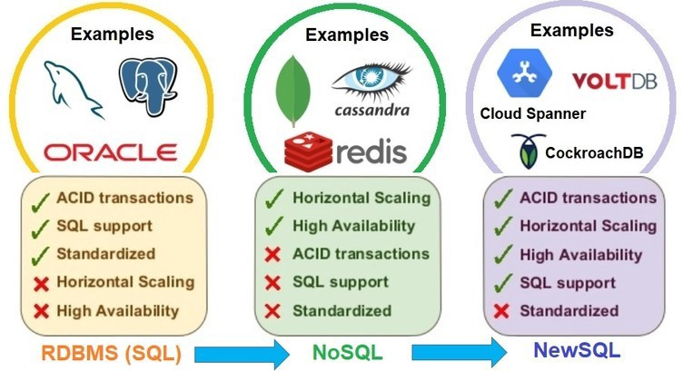

# Guided Project Walkthrough

We covered a lot of ground this week - today we'll bring it together, both
summarizing and resolving lingering questions. We'll also continue the
discussion from the before lecture activity, and explore the cutting edge
"NewSQL" techniques in active development.

As time allows, we'll go back to practicing good old SQL. It's important to have
a broad awareness of the database universe, but SQL is a time-tested tool that
has and will continue to be useful across a wide range of situations. It will
also be the largest part of the sprint challenge, and likely a component of many
job interviews.

## SQL vs NoSQL Review

Let's review important concepts from this week using the following questions:

1) What is a relational database?

2) What is a non-relational or NoSQL database?

3) What are the advantages of a relational database over a non-relational (NoSQL) database?

4) What are the advantages of a non-relational database over a relational database?

5) Which of the three databases did you prefer working with this week and why?

## ACID Properties

### Atomicity

Query execution is all-or-nothing. If the whole query can't complete its execution then the DB rolls back to its original state and it's like the query was never run.

The word "atom" is derived from the ancient Greek word "atomos" meaning "uncuttable" or "indivisible". When we refer to "atomicity" of databases we're referring to an entire query or operation needing to execute in an "all-or-nothing" manner. You should never have half of a query excute and then the second half err out leaving the data modified in a partial but incomplete way.

### Consistency

Only valid data is saved.

What consitutes valid data? And what enforces the data's validity?

### Isolation

Transactions do not affect each other. Reads and Writes are not impacted by other reads and writes.

### Durability

If you successfully add rows, tables, documents, etc to a database or update data in the database those changes (commits) should survive permanently.

---

Which kind of database system supports ACID transactions?

[MongoDB document about ACID transactions](https://www.mongodb.com/basics/acid-transactions)

## Database Scalability

### Vertical Scaling

Get a bigger and more powerful computer (more RAM, CPUs, Storage, etc) to hold your database.

Pros: You don't have to change anything about teh DB itself when you vertically scale, just the hardware.

Cons: Vertical Scaling is limited. There's a physical limit to how much CPU, memory, hard-drives, etc that you can pack into a single machine.

### Horizontal Scaling

Get more computers (instances) to share the load between them.

Pros: You can go as big as you want

Cons: Your DB may have some portions that are copied across multiple machines and not all of your documents live in one single place so the software to manage queries becomes more complicated. Luckily managed DB software handles a lot of this for us.

---

SQL databases typically require the whole DB and all of its tables to be stored on the same machine. This is required due to to the relational characteristics of the database that many queries require immediate access to the other tables through their shared primary and secondary (foreign) keys.

Due to this, vertical scaling is more commonly associated with SQL databases and horizontal scaling with NoSQL databases.

If you had a giant amount of data to store, which kind of scaling option would you need? And by extension, which kind of database would be better suited to the task?

[MongoDB document about Database Scalability](https://www.mongodb.com/databases/scaling)

## NewSQL

NewSQL systems seek to combine the horizontal scaling benefits of NoSQL with the ACID property benefits of SQL. Some use relational models, and some don't. There's still a lot of candidates vying to be the leader in this space and there's no clear winner. The bigest improvement IMO is that these NewSQL systems don't leave the committment to ACID properties in the hands of the developer like MongoDB does. They're trying to give us the best of both worlds. Keep an eye on this space!

